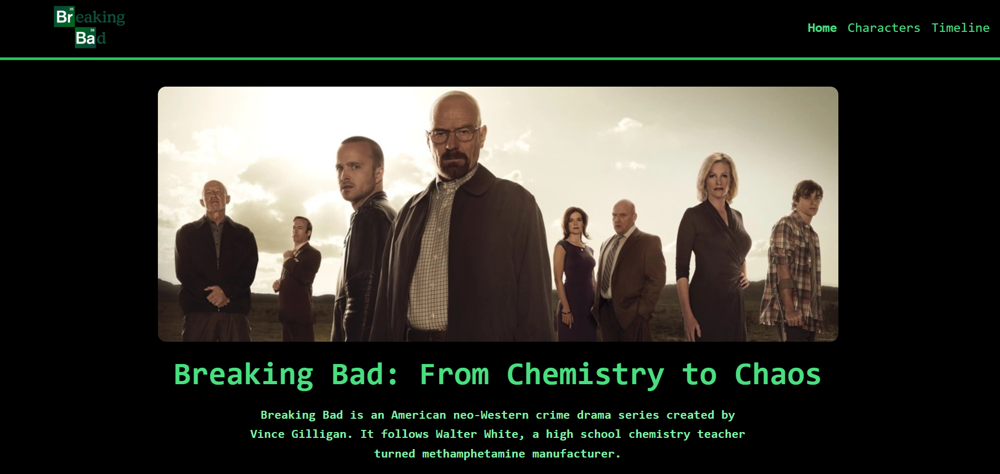
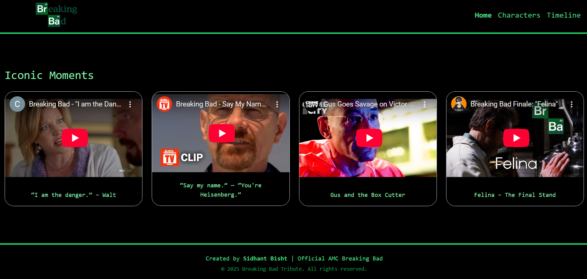
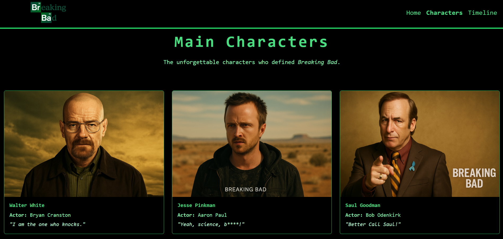
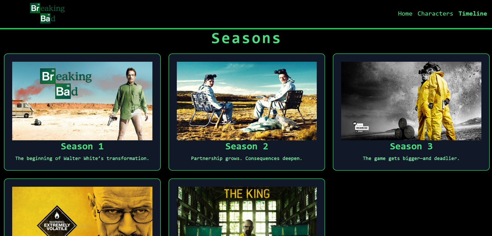

# 💥 Breaking Bad Tribute Page

Welcome to the **Breaking Bad Tribute Page** — a fan-made web experience that honors one of the greatest TV shows of all time. This project showcases iconic characters, unforgettable episodes, and legendary moments from AMC’s *Breaking Bad*, blending sleek visuals with informative content.

## 📖 Description

This tribute site is dedicated to the critically acclaimed TV series *Breaking Bad*, created by Vince Gilligan. It explores the journey of Walter White, a high school chemistry teacher turned meth manufacturer, diving deep into the show's gripping narrative, complex characters, and unforgettable quotes.

It includes:
- A dynamic hero section with trailers and Netflix link
- A detailed "About the Series" card
- A curated list of must-watch episodes
- An embedded video gallery of iconic moments

## 🌐 Live Demo

👉 [View Live Site](https://sidhant-codes.github.io/Breaking-Bad/)

## 🎯 Features

- 🧪 **Hero Section**  
  Large intro banner, show overview, and quick links to trailer and Netflix

- 🧬 **About the Series**  
  Highlights the show's premise, characters, creators, and accolades

- 📺 **Key Episodes**  
  Selected episodes that mark major turning points in the series

- 📹 **Iconic Moments Gallery**  
  Embedded YouTube scenes featuring legendary quotes and visuals

- 🖥️ **Responsive Design**  
  Optimized for mobile, tablet, and desktop devices

- 🎨 **Modern Styling**  
  Styled using Tailwind CSS + Bootstrap for sleek, dark-themed UI

- 🔗 **OG Meta Tags**  
  Included for rich social media link previews

## 🛠️ Technologies Used

- **HTML5** — Semantic page structure
- **Tailwind CSS** — Utility-first styling
- **Bootstrap 5** — Responsive layout and components
- **YouTube Embed** — Highlight scenes directly in the browser
- **Open Graph Tags** — Enhanced social media previews

## 🖼️ Screenshots

  
  
  
  

## 📜 License

This project is open-source and available under the [MIT License](LICENSE).

## 👨‍💻 Author

**Sidhant Bisht**

- 🌐 GitHub: [@sidhant-codes](https://github.com/sidhant-codes)
- 📧 Email: sidhantbisht1006@gmail.com

